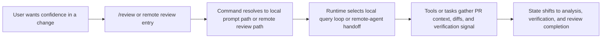
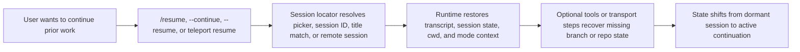
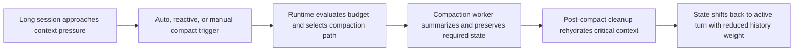
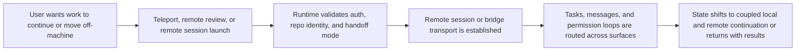

# End-to-End Scenario Graphs

This node captures the user-facing chain that rebuilders must preserve:

`user journey -> command -> runtime subsystem -> tool or task -> state transition`

These scenarios intentionally omit code-level detail and focus on product behavior.

## Review

## Resume

## Compact

## Remote handoff

## Design takeaway

The key reconstruction insight is that commands are not the real architecture. The real architecture is a set of reusable execution chains that commands enter at different points.
